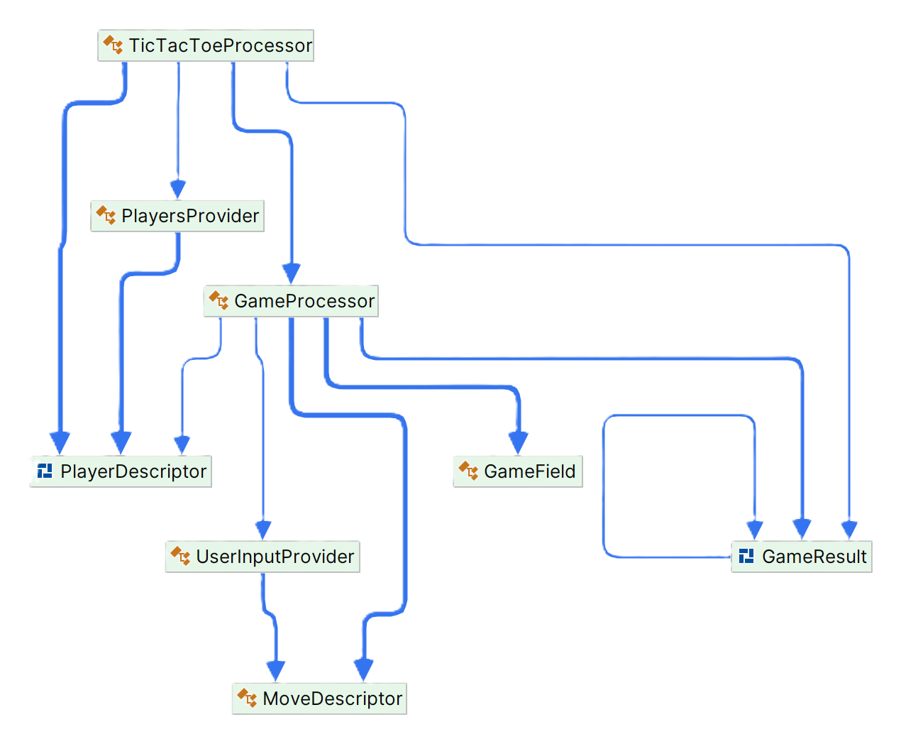
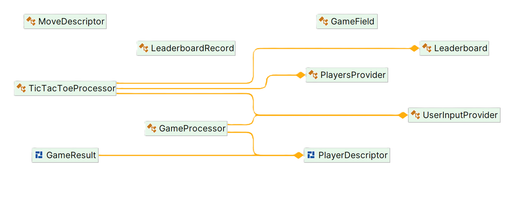

# Assignment 1 @ Tic-Tac-Toe

## Architecture overview

### Usages

This section outlines the classes and their relationships in a console-based Tic-Tac-Toe game.

The `TicTacToeProcessor` serves as the entry point, orchestrating gameplay by coordinating with other components.
`GameProcessor` manages the core game logic and state, while `PlayersProvider` and `UserInputProvider` handle player
details and input, respectively. The GameField class is crucial for board state management and game progression checks.
This structure allows for clear separation of concerns, enhancing maintainability and scalability.

### Return types

`TicTacToeProcessor` is injected with `PlayersProvider` and `UserInputProvider`, allowing for flexible player data
management
and user input handling. `GameProcessor` receives `UserInputProvider` and player information as dependencies. This
design decouples the game logic from input mechanisms and player management, facilitating easier testing and potential
future extensions, such as integrating different player types or input methods. Dependency injection thus plays a
crucial role in maintaining the code's flexibility and cleanliness.